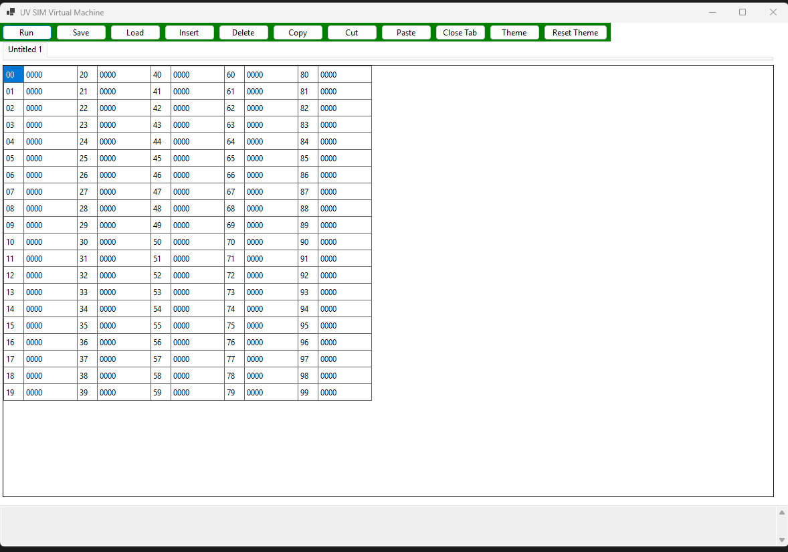
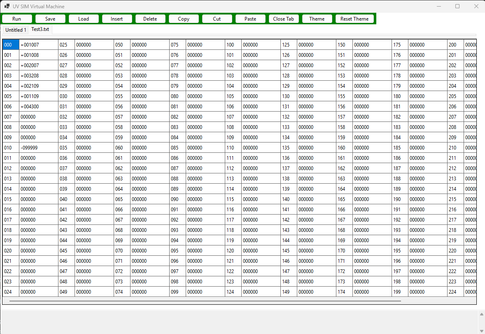
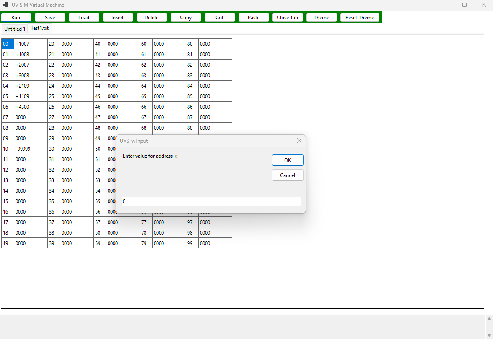
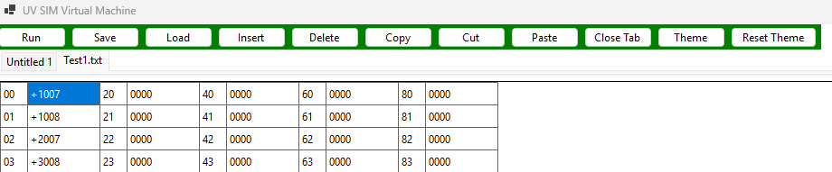
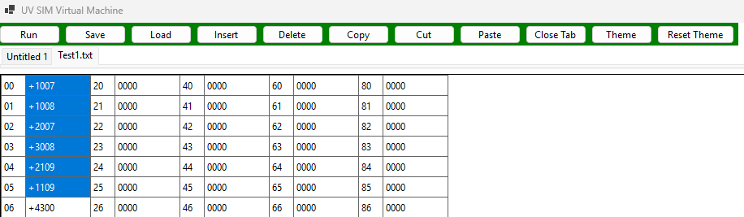
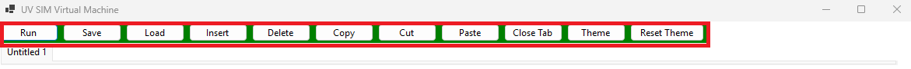

# User Manual

This application is a graphical simulator for executing machine-level instructions.  
It allows users to load, edit, and run programs while visualizing memory and CPU state.

---

## Getting Started

From the repository root, run:

```powershell
dotnet restore
dotnet run --project .\UVGUI\UVGUI.csproj
```

This will restore dependencies and launch the UV SIM application.

---

## Simulator Editor



---

### File Operations

#### Load

Load a file by clicking the **Load** button. This will open a new tab with the selected file loaded into memory and displayed in the GUI.

> ⚠️ **Note:** This system supports both 4-digit and 6-digit instructions.  
> If you load a 6-digit file, the GUI will automatically adapt for that tab.

### Example (6-digit format)



---

#### Save

Save your current file by clicking the **Save** button.  
This will export the contents of the active tab as a `.txt` file.

---

### Run a Program

To run a program, load a file into memory or manually edit memory, then click **Run**.

---

#### User Input

Certain opcodes require input from the user.  
When prompted, enter the desired value and click **OK**.



---

## Memory Editor

You can interact with each cell to input instructions into memory.  
You may also use the **Toolbar** to perform actions on one or multiple cells.

### Select One Cell



### Select Multiple Cells



---

## Toolbar

The toolbar allows you to modify the program currently loaded in memory.



### Actions

#### Insert *(Deprecated)*
This action is no longer used.

#### Delete
Deletes instructions in the selected cell(s).

#### Copy
Copies instructions from the selected cell(s).

#### Cut
Copies and removes instructions from the selected cell(s).

#### Paste
Pastes instructions starting at the selected cell.

#### Close Tab
Closes the currently selected tab.

#### Theme
Configure the application theme using two colors.

#### Reset Theme
Resets the theme to the default settings.