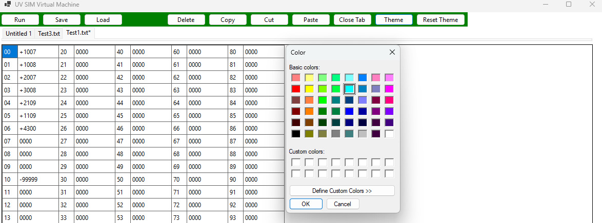

# User Manual

This application is a graphical simulator for executing machine-level instructions.  
It allows users to load, edit, and execute programs while visualizing memory and CPU state in real time.

---

## Getting Started

From the repository root, run:

```powershell
dotnet restore
dotnet run --project .\UVGUI\UVGUI.csproj
```

This will restore all required dependencies and launch the UV SIM application.

---

## Simulator Interface


The main interface provides access to memory, CPU state, program execution, and editing tools.

---

## File Operations

### Load

Click **Load** to open a program file.  
The selected file will be loaded into memory and displayed in a new tab.

> ⚠️ **Note:** This simulator supports both 4-digit and 6-digit instruction formats.  
> When loading a 6-digit program, the interface will automatically adjust for that format.

### Example (6-digit format)


---

### Save

Click **Save** to export the contents of the current tab to a `.txt` file.

---

## Running a Program

To execute a program:

1. Load a file or manually enter instructions into memory  
2. Click **Run**

The simulator will execute instructions until a **HALT** operation is encountered.

---

### User Input

Some instructions require user input during execution.  
When prompted, enter a value and click **OK**.


---

## Memory Editor

The memory grid allows direct editing of instructions.

- Click a cell to edit a single instruction  
- Select multiple cells to perform bulk operations  

### Single Cell Selection


### Multiple Cell Selection


---

## Toolbar

The toolbar provides tools for modifying memory and managing the current program.


### Actions

#### Delete
Clears the selected memory cell(s) without shifting other values.

#### Copy
Copies the contents of the selected cell(s).

#### Cut
Copies and clears the selected cell(s).

#### Paste
Pastes instructions starting at the selected memory address.

> ⚠️ **Note:** Pasting is limited by memory size and instruction format.  
> Invalid or oversized input will trigger an error message.

#### Close Tab
Closes the currently active tab.

---

## Theme Customization

The application supports customizable color themes.



#### Theme
Opens a dialog to select primary and secondary colors for the interface.

#### Reset Theme
Restores the default application theme.

---